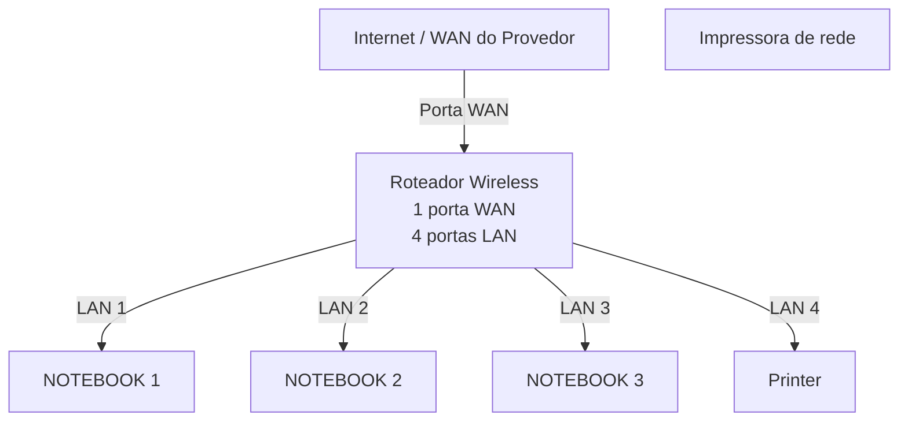
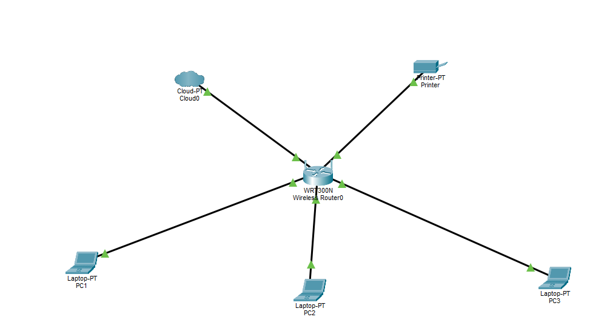

# Laboratorio de redes 01 - projeto de rede local
Projeto desenvolvido na disciplina de redes de computadores no curso técnico de informatica do SENAC

Aluno: Enzo Mesquita Becker

Professor: Jose de Assis

Data: 09/03/2026

---

##1. Objetivo
Implementar uma rede local simples conectando 3 notebooks a um roteador Wireless com switch integrado e uma impressora de rede.

O projeto será realizado em duas etapas:

1. Simulação de rede no Cisco Packet Tracer
2. Implementação de rede no laboratorio real

---

##2. Equipamentos ultilizados naste laboratório

- 3 Notebooks
- 1 Roteador wireless com 1 porta WAN e 4 portas LAN
- 1 Impressora de rede
- Cabos de rede

  ---

  ## 3 Topologia da rede
  Diagrama lógico da rede ultilizada neste laboratório:

imagem da topologia ultilizada no laboratorio

---
## 4 Plano de endereçamento IP

rede: 192.168.0.0/24

Gateway: 192.168.0.1

| Dispositivo | Tipo de IP | Endereço IP | Observa |
|-------------|-------------|-------------|-------------|
| Roteador | Estático | 192.168.0.1 | IP do roteador|
| Impressora | Reserva DHCP | 192.168.0.100 | IP reservado pelo roteador |
|  PC1 | Reserva DHCP | 192.168.0.101 | IP reservado pelo roteador |
| PC2 | DHCP | Automático | IP atribuido pelo roteador |
| PC3 | DHCP | Automático | IP atribuido pelo roteador |

**Observação**

- A impresssora e uma dos utilizam reserva DHCP
- O rotiador sempre atribui o mesmo endereço IP a esses dispositivos

  ---

  ## 5. Instalação no laboratório real

  Apos  a instalação, a rede foi montada fisicamente no laboratório

  Etapas realizadas

  Configuração do reteador e ajudei em algumas outras areas

  ---

  ## 6. Conclusão

  Este laboratório oermitiu compreender o funcionamento de uma rede local simples, incluindo

  - Estrutura de uma rede domestica ou  de pequeno escritório
  - Ultilização de um  roteador com porta WAN e portas LAN
  - Funcionamento do DHCP
  - Comunicação entre dispositivos na rede local
  - Ultilização de uma impressora  de rede
  - Compartilhamento de pastas na rede 

