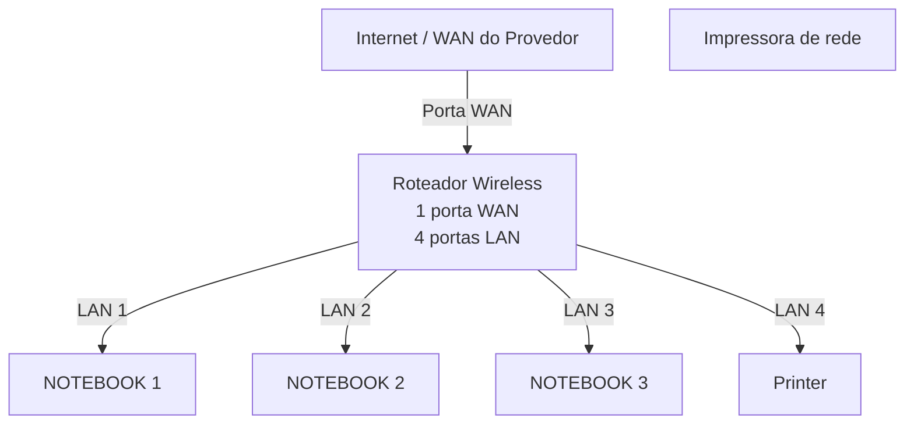

# Laboratorio de redes 01 - projeto de rede local
Projeto desenvolvido na disciplina de redes de computadores no curso técnico de informatica do SENAC

Aluno: Enzo Mesquita Becker

Professor: Jose de Assis

Data: 09/03/2026

---

##1. Objetivo
Implementar uma rede local simples conectando 3 notebooks a um roteador Wireless com switch integrado e uma impressora de rede.

O projeto será realizado em duas etapas:

1. Simulação de rede no Cisco Packet Tracer
2. Implementação de rede no laboratorio real

---

##2. Equipamentos ultilizados naste laboratório

- 3 Notebooks
- 1 Roteador wireless com 1 porta WAN e 4 portas LAN
- 1 Impressora de rede
- Cabos de rede

  ---

  ## 3 Topologia da rede
  Diagrama lógico da rede ultilizada neste laboratório:

